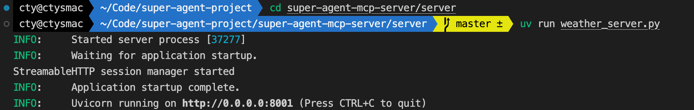
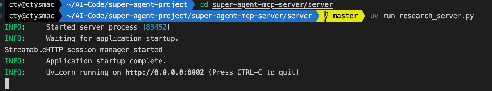

# 🧸 Super Agent MCP Server

## 🛠️ 准备环境

### 创建工程

```shell
cd super-agent-project
mkdir super-agent-mcp-server && cd super-agent-mcp-server
```

### 安装依赖

```shell
# 初始化项目
uv init
# 创建虚拟环境（.venv）并添加依赖
uv add loguru pytest pytest-mock pytest-asyncio mcp arxiv aiohttp
```

### 环境变量

* [高德开放平台](https://console.amap.com/)：提供 IP 定位、地址解析、天气查询服务

```shell
cat >> .env << 'EOF'
# 高德地图 API Key
AMAP_KEY=xxx
EOF
```

## MCP 服务

```text
server
  - weather_server   # 天气查询 MCP Server
      - _resolve_adcode()             # 解析城市名称或自动定位，获取行政区划代码
      - get_amap_weather_now()        # 获取当前的实时天气情况
      - get_amap_weather_forecast()   # 获取未来几天（含今天）的天气预报情况
  - research_server  # 学术研究 MCP Server
      - search_papers()               # 根据主题搜索arXiv上的论文并保存其信息
      - extract_info()                # 在所有主题目录中搜索有关特定论文的信息
      - get_available_folders()       # 列出论文目录中所有可用的主题文件夹
      - get_topic_papers()            # 获取特定主题论文的详细信息
      - generate_search_prompt()      # 生成一个提示，以查找和讨论关于特定主题的学术论文
```

## 启动服务

* 启动天气查询 MCP Server

```shell
# new terminal
cd super-agent-mcp-server/server

uv run weather_server.py
```



* 启动学术研究 MCP Server

```shell
# new terminal
cd super-agent-mcp-server/server

uv run research_server.py
```



